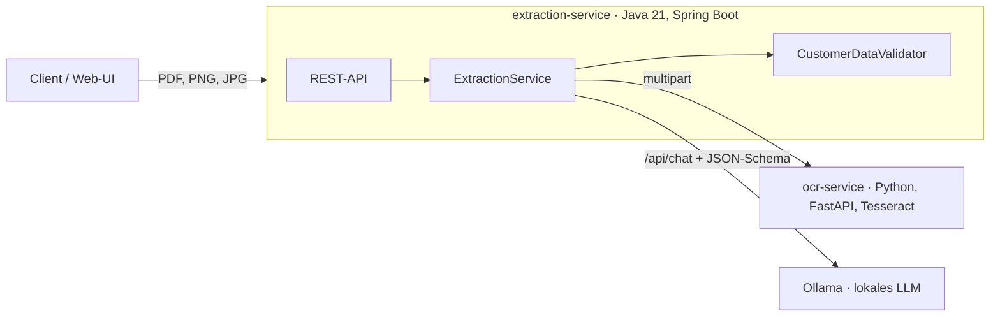

# Onboarding Document Extractor

Prototyp zur automatischen Auswertung von Kundendokumenten (Prüfaufträge, Anfragen, Formulare):
Ein gescanntes oder digitales Dokument wird hochgeladen, per **OCR** in Text umgewandelt, von einem
**lokalen Sprachmodell** in strukturierte Daten überführt und anschließend von einem **Java-Service
regelbasiert geprüft**. Das Ergebnis ist ein JSON-Datensatz mit Status `VALID` oder `NEEDS_REVIEW`.

Alle Komponenten laufen lokal – es verlassen keine Dokumentdaten das eigene Netz.

## Architektur



| Service | Aufgabe | Technik |
|---|---|---|
| `ocr-service` | Text aus Scans und PDFs gewinnen | Python 3.12, FastAPI, Tesseract, pypdfium2 |
| `extraction-service` | Ablaufsteuerung, Extraktion, Validierung, REST-API | Java 21, Spring Boot 3.5, RestClient |
| `ollama` | Lokales Sprachmodell (Standard: `qwen2.5:3b`) | Ollama |

## Designentscheidungen

**Digitale PDFs ohne OCR.** Hat ein PDF eine Textebene, wird sie direkt gelesen. Tesseract läuft nur für
gescannte Seiten – das ist schneller und fehlerfrei.

**Structured Outputs statt Freitext.** Das JSON-Schema der Zieldaten wird Ollama als `format` übergeben.
Das Modell kann dadurch nur schema-konformes JSON erzeugen; Parsing-Fehler durch Erklärtext oder fehlende
Klammern entfallen. Temperatur 0 sorgt für reproduzierbare Ergebnisse.

**Das Modell schlägt vor, der Java-Service entscheidet.** Die Validierung ist bewusst deterministisch:

- Pflichtfelder (Firma, Ansprechperson, E-Mail)
- Formate: E-Mail, deutsche PLZ, Normbezeichnungen
- **Prüfziffer der USt-IdNr.** nach ISO 7064 MOD 11,10 – erkennt Lese- und Tippfehler, die weder OCR noch Modell bemerken
- **Abgleich mit dem Quelltext:** Jeder extrahierte Wert muss im OCR-Text vorkommen. So fallen
  Halluzinationen des Modells auf. Der Vergleich toleriert typische OCR-Fehler (Umlaute, Leerzeichen,
  Groß-/Kleinschreibung); Telefonnummern werden über die letzten Ziffern verglichen, weil das Modell sie oft umformatiert.
- Geringe OCR-Konfidenz (< 70 %) wird als Hinweis ausgegeben

Jede Auffälligkeit führt zu `NEEDS_REVIEW` – der Datensatz geht dann nicht automatisch ins Kernsystem,
sondern zu einem Menschen (Human in the Loop).

**Austauschbares Modell.** Die Extraktion liegt hinter dem Interface `LlmExtractor`. Ein anderes Modell
ist eine Umgebungsvariable (`OLLAMA_MODEL`), ein anderer Anbieter eine neue Implementierung.

## Starten

Voraussetzung: [Docker Desktop](https://www.docker.com/products/docker-desktop/). Beim ersten Start wird
das Modell (~2 GB) heruntergeladen.

```bash
docker compose up --build
```

Danach:

- Web-Oberfläche: <http://localhost:8080>
- REST-API: <http://localhost:8080/api/documents>

Auf CPU dauert die erste Anfrage länger (Modell wird geladen), danach je nach Rechner etwa 5–30 Sekunden.
Wer Ollama bereits nativ installiert hat (schneller, nutzt die GPU), startet nur die übrigen Dienste und
setzt `OLLAMA_BASE_URL=http://host.docker.internal:11434`.

### Ohne Docker

```bash
# 1. Ollama installieren, dann:
ollama pull qwen2.5:3b

# 2. OCR-Service (Tesseract mit deutschem Sprachpaket muss installiert sein)
cd ocr-service
pip install -r requirements.txt
uvicorn app.main:app --port 8000

# 3. Extraction-Service
cd extraction-service
mvn spring-boot:run
```

## API

```bash
curl -F "file=@samples/pruefauftrag_scan.png" http://localhost:8080/api/documents
```

Beispielantwort (Zeit- und Konfidenzwerte hängen vom Rechner ab):

```json
{
  "id": "3f1c…",
  "filename": "pruefauftrag_scan.png",
  "status": "VALID",
  "data": {
    "companyName": "Nordlicht Funktechnik GmbH",
    "street": "Hafenstraße 12",
    "postalCode": "45127",
    "city": "Essen",
    "country": "Deutschland",
    "vatId": "DE812345673",
    "contactPerson": "Dr. Anna Becker",
    "email": "a.becker@nordlicht-funk.example",
    "phone": "+49 201 555 0182",
    "product": "NLT-Sensor 868 (LoRa-Funkmodul)",
    "standards": ["EN 300 220-2", "EN 301 489-3", "EN 62368-1"]
  },
  "issues": [],
  "ocr": { "method": "ocr", "meanConfidence": 91.2, "pages": 1, "characters": 486 },
  "model": "qwen2.5:3b",
  "durationMs": 7421
}
```

| Methode | Pfad | Beschreibung |
|---|---|---|
| `POST` | `/api/documents` | Dokument hochladen (multipart, Feld `file`), liefert `201` mit Ergebnis |
| `GET` | `/api/documents/{id}` | Ergebnis abrufen |
| `GET` | `/api/documents` | Alle Ergebnisse, neueste zuerst |

Fehler werden als Problem Details (RFC 9457) zurückgegeben, z. B. `502`, wenn OCR-Service oder Modell nicht erreichbar sind.

## Beispieldokumente

Im Ordner `samples/` (alle Daten frei erfunden, erzeugt mit `tools/generate_samples.py`):

| Datei | Inhalt | Erwartung |
|---|---|---|
| `pruefauftrag_scan.png` | Gescanntes Formular (leicht schief, Rauschen) | `VALID` |
| `pruefauftrag_digital.pdf` | Digitales PDF mit Textebene – kein OCR nötig | `VALID` |
| `anfrage_brief_scan.png` | Unstrukturierter Brief, USt-IdNr. mit falscher Prüfziffer | `NEEDS_REVIEW` (`INVALID_CHECKSUM`) |

## Tests

```bash
cd ocr-service && pip install -r requirements-dev.txt && pytest
cd extraction-service && mvn test
```

Die Java-Tests laufen ohne Ollama und OCR-Service: HTTP-Aufrufe werden mit `MockRestServiceServer`
simuliert, der Controller mit `@WebMvcTest` getestet.

## Grenzen des Prototyps und nächste Schritte

- Ergebnisse liegen nur im Speicher → Persistenz mit PostgreSQL/JPA
- Synchrone Verarbeitung → bei großen Dokumenten asynchron mit Queue und Status-Abfrage
- Kein Abgleich mit Stammdaten → Dublettenprüfung gegen bestehende Kunden
- Keine systematische Qualitätsmessung → Testset mit bekannten Soll-Werten, Trefferquote pro Feld und Modell
- Keine Authentifizierung
